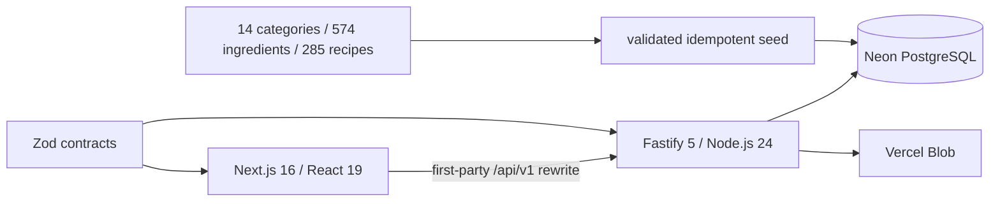

# So Yummy

A full-stack recipe platform built as a portfolio project from a supplied Figma design and product brief. It combines a handcrafted responsive UI with an independently deployable Node.js API.

## Architecture



The pnpm/Turborepo monorepo contains:

- `apps/web` — Next.js App Router, React Server Components, React Query and CSS design tokens.
- `apps/api` — Fastify REST API, opaque cookie sessions, OpenAPI and Swagger UI.
- `packages/contracts` — shared Zod input contracts and public TypeScript types.
- `packages/db` — Drizzle schema, SQL migration and advisory-lock-protected seed.
- `packages/api-client` — credential-aware browser client.

## Local development

Prerequisites: Node.js 24 LTS and pnpm 10.

```bash
pnpm install
cp .env.example .env
pnpm dev
```

Web: `http://localhost:3000` · API: `http://localhost:4000` · Swagger: `http://localhost:4000/docs`

The web app reads the supplied public catalog directly during local rendering. PostgreSQL is required for migrations and production persistence; set `DATABASE_URL`, apply the SQL files in `packages/db/migrations` in order, then run `pnpm db:seed`.

Authentication emails use Mailjet Send API v3.1. Configure `MAILJET_API_KEY`, `MAILJET_SECRET_KEY`, a stable random `AUTH_CODE_PEPPER`, `EMAIL_FROM_ADDRESS`, `EMAIL_FROM_NAME`, and `EMAIL_DELIVERY_MODE=send` on the API deployment. Local development defaults to `EMAIL_DELIVERY_MODE=log`, which prints one-time codes instead of sending them.

## Quality gates

```bash
pnpm format:check
pnpm lint
pnpm typecheck
pnpm test
pnpm build
pnpm test:e2e
```

GitHub Actions repeats these checks with PostgreSQL 17 and Playwright. API errors use `{ code, message, fieldErrors?, requestId }`; paginated endpoints use `{ items, page, pageSize, total, pageCount }`.

## Deployment

Create two Vercel projects from the same repository:

| Project        | Root directory | Region                 |
| -------------- | -------------- | ---------------------- |
| `so-yummy-web` | `apps/web`     | automatic edge network |
| `so-yummy-api` | `apps/api`     | `fra1`                 |

Provision Neon and Blob through Vercel Marketplace, connect them to the API, and set `API_ORIGIN` on the web project. Related Projects keeps preview rewrites first-party. Apply every SQL migration and seed the catalog before deploying the API and web projects together.

## Security

Passwords use Argon2id. Sessions use a random 256-bit token in a Secure, HttpOnly, SameSite=Lax cookie; only a SHA-256 token digest belongs in persistent storage. Six-digit authentication codes are protected with an HMAC pepper, expire after ten minutes, and are attempt- and delivery-limited. Uploads are limited to JPEG, PNG and WebP files up to 5 MB. Helmet, a CORS allowlist, payload limits and secret-redacted Pino logs are enabled.

## Data and license

Source code is MIT licensed. Supplied third-party data and assets are explicitly excluded from relicensing; see [NOTICE.md](NOTICE.md). The source JSON copied to `data/source` is validated before every seed and retains original textual ObjectIds.
